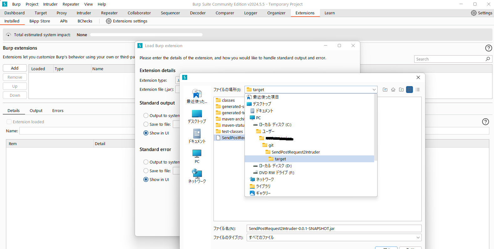

# SendPostRequest2Intruder
This is an extension that works with Burp Suite. The extension automatically sends all POST requests to the Intruder.
## Be careful
This repository was created as my learning output.  
I don’t recommend running it in a production environment.

## Installation
1. Clone this repository OR download jar file from Releases.
1. Import jar file at Extensions > Add > Select File ...  
> You can import jar file on `<this repo>/target` OR your PC's download folder.  

